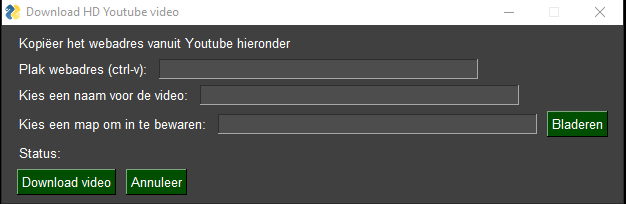
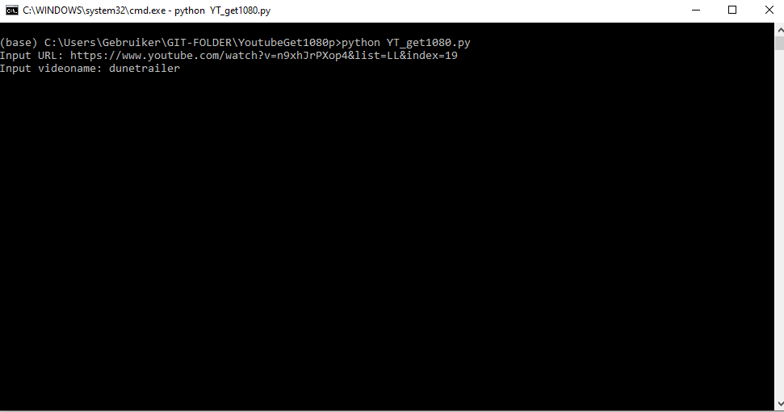

# YoutubeGet1080p
Downloader for 1080p youtubevideo with audio

-------------

EDIT: 

I crafted a simple GUI (in dutch for the moment) so I can share it with colleagues and friends. At Sphinx cinema we were in need of high resolution trailers that were easily and quickly downloaded for use on the website and our signage screens at the cash register. You do not need to install python and the required libraries to work with this exe file, so everyone can use it after download.

!YOU MUST HAVE ffmpeg.exe IN THE SAME FOLDER AS THE GUI EXECUTABLE FILE!
(but you can shortcut to the gui executable from somewhere else.)

-------------

IDEA:

A simple python file for downloading a youtube video in 1080p and with audio. There are websites online that can do that for you. But they are dubious in nature and often do not have the option to download in full 1080p and/or do not have the audio present.

TECH:

I combined the libraries pytube, ffmpy and os to pull of the URL and combine video and audio to the inputted filename.

You have to pip install all mentioned libs.

pip install pytube
pip install ffmpy
pip install os

EXTRA INFO AND TIPS:

Output files are created in the folder of the script as an mp4. Unless you use the GUI, then you can choose the output folder.

